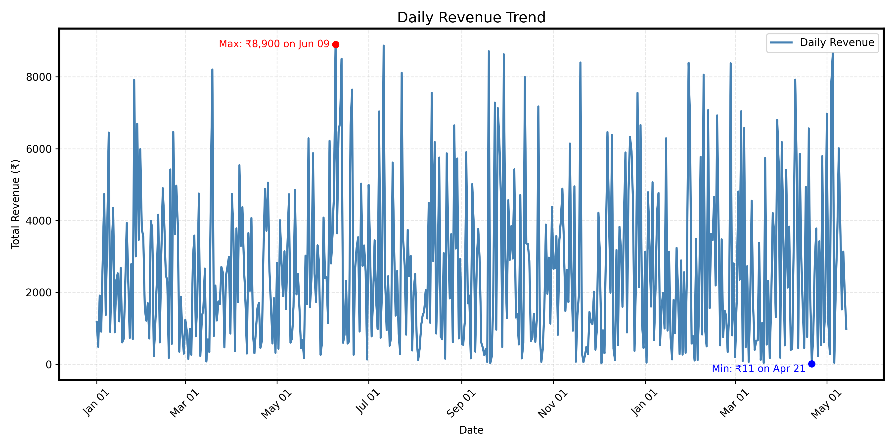
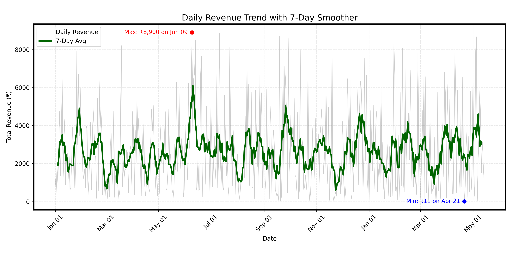
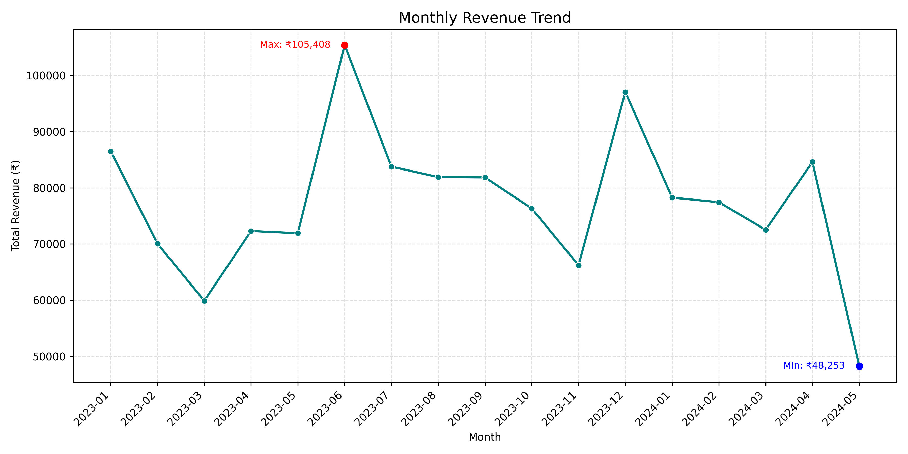
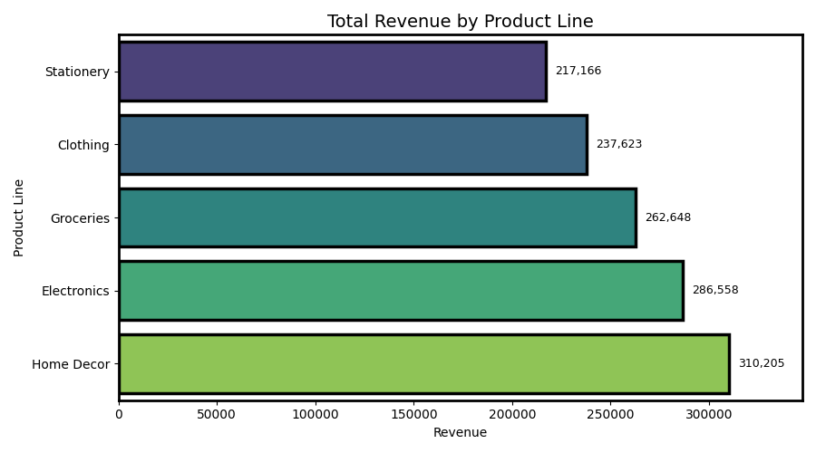
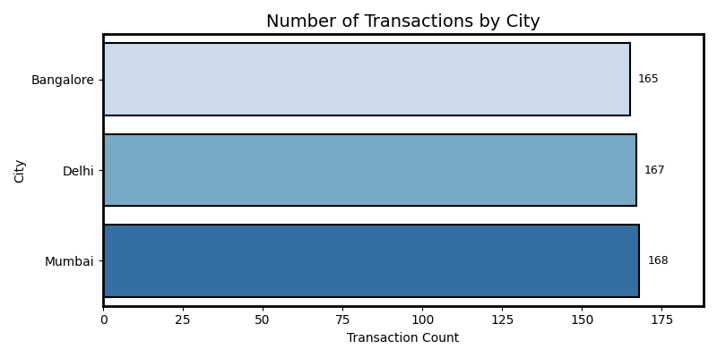

[](https://www.python.org/)
[](https://jupyter.org/)
[]()

# Mini Retail Sales Analysis Dashboard

Analyze, visualize, and derive insights from a compact dataset of 500 retail transactions across 3 cities and 6 product lines. This project helps uncover customer behavior, top-selling categories, payment preferences, and revenue patterns.

---

## 📦 Dataset Overview

- **Source:** Internal Mock Dataset  
- **Size:** 500 transactions  
- **Date Range:** Jan 2023 – May 2024  
- **Columns Include:**  
  `Invoice ID`, `Date`, `City`, `Product Line`, `Unit Price`, `Quantity`, `Payment Method`, `Total Revenue`, `Profit`, and derived time features.

---

## 📊 Features & Deliverables

- **Revenue Insights**
  - Highest grossing product line (Home Decor)
  - Daily, weekly, and monthly revenue trend analysis

- **Customer Segmentation**
  - Transaction count by city
  - Average order value (AOV) across cities
  - **Top City by Transactions:** Mumbai (168 orders) – large customer base, frequency-driven

- **Operational Metrics**
  - Quantity sold by product category
  - Profit margin by location

- **Payment Analysis**
  - Most popular payment methods
  - Revenue by payment mode

---

## 📁 Project Structure

```plaintext
mini-sales-analysis/
├── data/
│   └── mini_retail_sales_dataset.csv
├── notebook/
│   └── sales_analysis.ipynb
├── visualizations/
│   ├── daily_revenue_trend.png
│   ├── revenue_by_product.png
│   ├── transactions_by_city.png
│   └── monthly_revenue_trend.png
├── summary.md
└── README.md
```

---


## 💡 How to Use
1. Clone the repository:
   ```bash
   git clone https://github.com/yourusername/mini-sales-analysis.git
   cd mini-sales-analysis
   ```

2. Open the project folder in **Visual Studio Code**.

3. Launch the Jupyter Notebook inside VS Code:
   - Make sure the Python extension is installed.
   - Open `notebook/sales_analysis.ipynb`
   - Run cells using the built-in Jupyter interface.

4. View generated outputs and charts in the `visualizations/` folder.

---

## 📈 Sample Visuals

<table>
  <tr>
    <td align="center"><strong>Daily Revenue Trend</strong></td>
    <td align="center"><strong>Daily Trend (Smoother)</strong></td>
    <td align="center"><strong>Monthly Revenue Trend</strong></td>
  </tr>
  <tr>
    <td align="center">
      
    </td>
    <td align="center">
      
    </td>
    <td align="center">
      
    </td>
  </tr>
  <tr>
    <td align="center"><strong>Revenue by Product</strong></td>
    <td align="center"><strong>Transactions by City</strong></td>
    <td></td>
  </tr>
  <tr>
    <td align="center">
      
    </td>
    <td align="center">
      
    </td>
    <td></td>
  </tr>
</table>


---

## ⚙️ Tech Stack

- **Python** – pandas, numpy  
- **Visualization** – seaborn, matplotlib  
- **VS Code + Jupyter Extension** – for notebook execution  
- **Markdown** – for summary and reporting

---

## 👩‍💻 Author

**Yukta Sharma**   
🌐 [GitHub](https://github.com/yourusername)  
📧 mail4yukta@gmail.com
